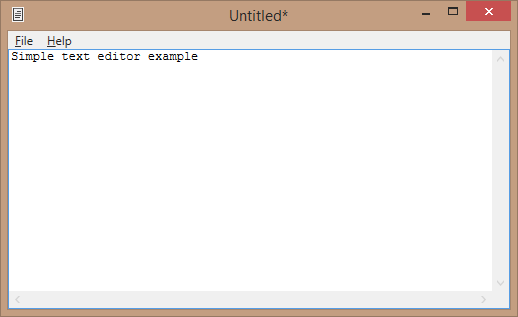

# Cas.Common.WPF
Common code for WPF and MVVM.

# Controls
- [AutoGreyableImage](http://weblogs.asp.net/thomaslebrun/archive/2009/03/03/wpf-how-to-gray-the-icon-of-a-menuitem.aspx) - Shows an image is "greyed out" when "IsEnabled" is false.
- [BindablePasswordBox](http://stackoverflow.com/a/3214538/232566) - Makes the password box MVVMable.

# Behaviors
- AnimateOnChangeBehavior - Triggers an animation when a bound property changes.
- BindableSelectedTreeViewItemBehavior - Sets a property in the ViewModel when the selected item changes in a TreeView.
- CloseableBehavior - closes a window from a ViewModel without the ViewModel referencing the View.
- DraggableBehaviorBase - Provides a simple mechanism for dragging visuals around a design surface.
- MultiSelectorSelectedItemsBehavior - Allows binding SelectedItems to a ViewModel.
- SelectAllOnFocusBehavior - Selects all text when a TextBox receives focus.

# MVVM Interfaces
- IFileDialogService - For showing Open/Save dialogs in an injectable way.
- IMessageBoxService - For showing message boxes in an injectable way.
- IViewService - Create windows without the ViewModel needing to know about the view.
  - IMarkClean - Can mark the service as clean.
  - IMarkDirty - Can mark the service as dirty.
- IDirtyService - Keeps track of whether a persistable unit has unsaved changes.
- ITextEditService - A simple popup for editing text.
- ICloseableViewModel - Supports the CloseableBehavior for closing a window from the ViewModel.

# Extension Properties
- FocusExtension - Provides a way to set focus to an element from the ViewModel.

# Utilities / Classes
- WindowUtil
  - [GetActiveWindow()](http://stackoverflow.com/questions/2038879/refer-to-active-window-in-wpf)
- OrderedListViewModel - Provides an easy to to re-order elements in a list.
- FrameworkElementExtensions - Provides access to the ViewModel from the view.

# Converters
- CollapsedWhenFalseConverter
- CollapsedWhenTrueConverter
- HiddenWhenFalseConverter
- HiddenWhenTrueConverter

# Examples
- AnimateOnChangeExample
- AutoGreyableImageExample
- BindablePasswordBoxExample
- BindableSelectedTreeViewItemExample
- CloseableExample
- ConverterExample
- DraggableExample
- FileDialogServiceExample
- FocusExample
- MessageBoxServiceExample
- MultiSelectorExample
- OrderedListExample
- PerformViewModelAction
- TextEditServiceExample
- ViewServiceExample
- TextEditorApplication - Example application that uses DI ([Dependency Injection](https://en.wikipedia.org/wiki/Dependency_injection)) to demonstrate a complete application.

